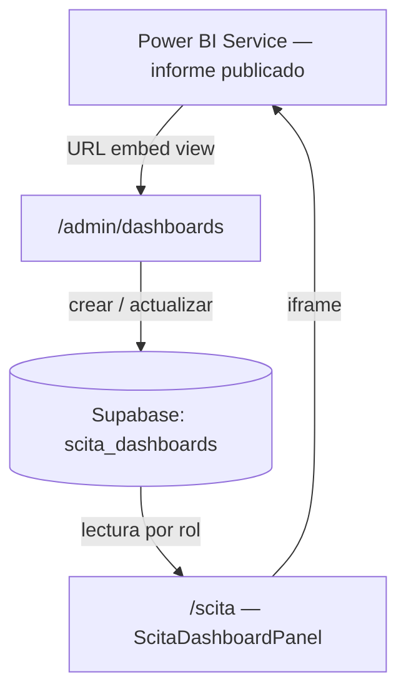

# Plataforma Palenke — Publicación de tableros SCITA desde la pagian 

**Versión:** 1.0  
**Ámbito:** Módulo SCITA en plataforma Palenke  
**Audiencia:** Equipo técnico, coordinación territorial, administradores de tableros

---

## Contenido

- [Objetivo](#objetivo)
- [Arquitectura de integración](#arquitectura-de-integración)
- [Flujo operativo: de Power BI Service a /scita](#flujo-operativo-de-power-bi-service-a-scita)
- [Creación de un tablero en el administrador](#creación-de-un-tablero-en-el-administrador)
- [Actualización de un tablero existente](#actualización-de-un-tablero-existente)
- [Campos del registro y convenciones](#campos-del-registro-y-convenciones)
- [Visibilidad, estados y permisos](#visibilidad-estados-y-permisos)
- [Validaciones automáticas de la plataforma](#validaciones-automáticas-de-la-plataforma)
- [Catálogo de respaldo y entornos sin base de datos](#catálogo-de-respaldo-y-entornos-sin-base-de-datos)
- [Checklist antes de publicar en producción](#checklist-antes-de-publicar-en-producción)
- [Registro de control recomendado](#registro-de-control-recomendado)
- [Referencias técnicas en el repositorio](#referencias-técnicas-en-el-repositorio)

---

## Objetivo

Este documento describe el procedimiento para **incorporar y mantener tableros Power BI ya publicados** dentro del módulo **SCITA** de la plataforma Palenke (`/scita`).

Palenke no construye ni modela los datos del tablero. Su función es:

- registrar metadatos del tablero (título, descripciones, módulo, visibilidad);
- almacenar la URL de embed autorizada;
- controlar qué usuarios ven tableros públicos e internos;
- presentar el iframe con parámetros de accesibilidad y recorte visual del pie de Power BI.

## Arquitectura de integración

| Capa | Tecnología | Rol |
|------|------------|-----|
| Origen del tablero | Power BI Service | Informe publicado y URL de embed |
| Persistencia | Supabase (PostgreSQL) · tabla `scita_dashboards` | Catálogo de tableros embebidos |
| Administración | Next.js · `/admin/dashboards` | CRUD solo para rol **admin** |
| Visualización | Next.js · `/scita` | Panel territorial con menú por módulo |
| Respaldo | Código (`SCITA_DASHBOARD_FALLBACK`) | Catálogo local si no hay conexión a Supabase |

Migración de referencia: `supabase/migrations/018_scita_dashboards.sql`.

## Flujo operativo: de Power BI Service a /scita

1. Tener el tablero **publicado** en Power BI Service con el nivel de acceso acordado (público o interno).
2. Obtener el enlace de visualización: **Archivo → Insertar informe → Sitio web o portal → URL de publicación** (formato `https://app.powerbi.com/view?r=...`).
3. Verificar en navegador incógnito (público) o con cuenta autorizada (interno) que el embed carga correctamente.
4. Iniciar sesión en Palenke con usuario **admin**.
5. Ir a **Administración → SCITA — Tableros Power BI** (`/admin/dashboards`).
6. Crear o editar el registro según [Creación](#creación-de-un-tablero-en-el-administrador) o [Actualización](#actualización-de-un-tablero-existente).
7. Confirmar en `/scita` con el rol correspondiente (visitante vs. interno/admin).
8. Actualizar el [registro de control](#registro-de-control-recomendado) institucional.

## Creación de un tablero en el administrador

**Ruta:** `/admin/dashboards` → **+ Nuevo tablero SCITA** → `/admin/dashboards/nuevo`

**Pasos:**

1. Seleccionar **Módulo** (`gobierno`, `conservacion`, `titulacion`). Define en qué sección del menú lateral de SCITA aparece el tablero.
2. Definir **Visibilidad**:
   - `Público` — visible para cualquier visitante en `/scita` (si el estado es `Activo`).
   - `Interno` — solo usuarios con sesión **interna** o **admin**.
3. Completar textos de interfaz: título, etiqueta corta (menú), descripción, descripción extendida (banner), viñetas (una por línea).
4. Configurar **Título del iframe** con prefijo institucional:
   - `P_` + nombre → tablero público (accesibilidad y trazabilidad).
   - `I_` + nombre → tablero interno.
5. Pegar **URL embed Power BI** (debe comenzar con `https://app.powerbi.com/`).
6. Ajustar dimensiones si es necesario: ancho/alto del embed y **recorte pie Power BI** (px; valor por defecto 56).
7. Elegir **Estado**: `Borrador` para pruebas, `Activo` para publicar, `Desactivado` para retirar sin borrar.
8. Definir **Orden en menú** (`sort_order`) para priorizar módulos en la lista.
9. Seleccionar **Ícono** del módulo.
10. Guardar con **Crear tablero**. El sistema redirige a la pantalla de edición con confirmación.

**Restricción de base de datos:** solo puede existir **un tablero por combinación** `módulo + visibilidad` (`unique (module_key, visibility)`). Por ejemplo, un tablero público y otro interno de Gobierno propio pueden coexistir; no dos públicos del mismo módulo.

## Actualización de un tablero existente

**Ruta:** `/admin/dashboards` → filtrar/buscar → **Editar** → `/admin/dashboards/[id]/editar`

**Casos frecuentes:**

| Cambio en Power BI | Acción en Palenke |
|--------------------|-------------------|
| Nuevos datos / medidas (misma URL) | No cambiar URL; opcional actualizar textos o viñetas |
| Republicación con **nueva URL** de embed | Actualizar campo **URL embed Power BI** y fecha en registro de control |
| Tablero pasa de interno a público | Crear versión pública en Power BI; nuevo registro `visibility: public` o editar según estrategia; respetar `unique (module_key, visibility)` |
| Retirar temporalmente | Estado → `Desactivado` o `Borrador` |
| Ajuste visual del iframe | Modificar ancho, alto o `footer_crop_px`; usar **Previsualizar embed** en edición |

Al guardar, la plataforma **revalida** las rutas `/scita` y `/admin/dashboards` para reflejar cambios de inmediato.

## Campos del registro y convenciones

| Campo (formulario) | Columna DB | Uso |
|--------------------|------------|-----|
| Módulo | `module_key` | Agrupación en SCITA: gobierno, conservación, titulación |
| Visibilidad | `visibility` | `public` \| `internal` |
| Título | `title` | Nombre completo del tablero |
| Etiqueta corta | `short_label` | Texto en menú lateral |
| Descripción (menú) | `description` | Resumen bajo el menú |
| Descripción extendida | `detail_description` | Texto del banner contextual |
| Viñetas del banner | `detail_bullets` (jsonb) | Lista de puntos de lectura; una viñeta por línea en el formulario |
| Título del iframe | `iframe_title` | Atributo `title` del iframe; usar `P_` / `I_` |
| URL embed | `embed_url` | Enlace `view?r=` de Power BI Service |
| Ancho / Alto embed | `embed_width`, `embed_height` | Dimensiones del viewport (default 600 × 373.5) |
| Recorte pie | `footer_crop_px` | Oculta barra inferior de Power BI en el embed |
| Ícono | `icon_src` | Ruta bajo `/assets/scita/icons/` |
| Estado | `status` | `active` \| `draft` \| `disabled` |
| Orden | `sort_order` | Orden ascendente en el menú |

## Visibilidad, estados y permisos

**Quién ve qué en `/scita`:**

| Rol en Palenke | Tableros `public` activos | Tableros `internal` activos |
|----------------|---------------------------|-----------------------------|
| Visitante (sin sesión) | Sí | No |
| Usuario autenticado estándar | Sí | No |
| Rol **internal** | Sí | Sí |
| Rol **admin** | Sí | Sí |

**Políticas RLS (Supabase):**

- Lectura pública: `visibility = 'public'` y `status = 'active'`.
- Lectura interna: `status = 'active'` y usuario con rol `internal` o `admin` activo.
- Escritura (CRUD admin): solo rol `admin`.

**Quién puede administrar tableros:** únicamente usuarios **admin** en `/admin/dashboards` (server actions `createScitaDashboardAction`, `updateScitaDashboardAction`).

## Validaciones automáticas de la plataforma

Al guardar, Palenke valida:

- módulo, visibilidad y estado con valores permitidos;
- título, etiquetas y descripciones obligatorios;
- URL de embed obligatoria y con dominio `https://app.powerbi.com/`;
- ícono obligatorio.

Errores se muestran en la misma pantalla de creación/edición. Si falta configuración de Supabase en el servidor, el guardado redirige con aviso `missing-config`.

## Catálogo de respaldo y entornos sin base de datos

Si **no** está configurado el cliente de servicio de Supabase, la administración muestra advertencia **“Sin persistencia”** y `/scita` usa el catálogo estático definido en código (`SCITA_DASHBOARD_FALLBACK` en `src/lib/scita-dashboards.ts`).

Para operación en producción se requiere:

- migración `018_scita_dashboards.sql` aplicada;
- variables de entorno de Supabase service en el servidor;
- registros gestionados desde `/admin/dashboards`.

## Checklist antes de publicar en producción

- [ ] Tablero publicado en Power BI Service y URL de embed disponible.
- [ ] Tipo público/privado alineado con la política de datos acordada.
- [ ] Prefijo `P_` o `I_` en título del iframe.
- [ ] URL embed probada en ventana privada / sesión interna según corresponda.
- [ ] Módulo y visibilidad correctos; sin conflicto `module_key + visibility`.
- [ ] Textos del banner revisados (descripción extendida y viñetas).
- [ ] Estado `Activo` solo cuando el tablero esté listo para usuarios.
- [ ] Verificación visual en `/scita` (embed, recorte de pie, menú).
- [ ] Registro actualizado en control institucional de enlaces.

## Registro de control recomendado

Mantener un archivo de control con al menos estos campos por tablero embebido en Palenke:

| Campo | Ejemplo |
|-------|---------|
| Nombre del tablero | Instrumentos de Gobierno Propio |
| Tipo | Público / Interno |
| Módulo SCITA | `gobierno` |
| Responsable | Persona o equipo a cargo |
| URL embed Power BI | `https://app.powerbi.com/view?r=...` |
| ID Palenke | `a1b2c3d4-...` (UUID en `scita_dashboards`) |
| Ruta admin | `/admin/dashboards/{id}/editar` |
| Visibilidad Palenke | `public` / `internal` |
| Estado Palenke | `active` / `draft` / `disabled` |
| Orden menú | `10` |
| Fecha última edición | `2026-05-19` |

Mantener **una fila por registro de embed** en Palenke (no por archivo `.pbix`), de modo que un mismo módulo pueda tener filas separadas para versión pública e interna.

Actualizar el control cada vez que:

- se registre un nuevo tablero en Palenke;
- se modifique un enlace de embed;
- cambie visibilidad o estado;
- se republicue el informe en Power BI con nueva URL.

## Referencias técnicas en el repositorio

| Recurso | Ubicación |
|---------|-----------|
| Tabla y seed inicial | `supabase/migrations/018_scita_dashboards.sql` |
| Lógica de lectura y respaldo | `src/lib/scita-dashboards.ts` |
| Acciones de administración | `src/app/admin/dashboards/actions.ts` |
| Formulario admin | `src/components/palenke/ScitaDashboardAdminForm.tsx` |
| Listado admin | `src/app/admin/dashboards/page.tsx` |
| Vista pública SCITA | `src/app/scita/page.tsx`, `src/components/palenke/ScitaDashboardPanel.tsx` |
| Guía de uso para visitantes | `src/components/palenke/ScitaDashboardGuideModal.tsx` |

---

*Protocolo operativo de publicación de tableros Power BI en el módulo SCITA de la plataforma Palenke.*
