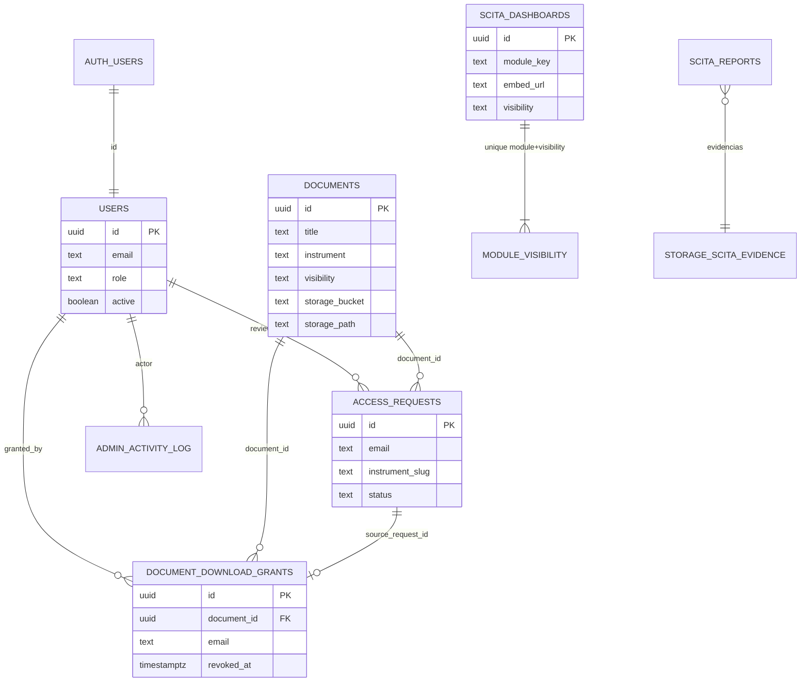

# Plataforma Palenke - Documentacion Tecnica MVP

Version: 1.1  
Fecha: 2026-07-17  
Estado: Base tecnica para MVP (Fase 1) + modelo de datos Supabase/PostgreSQL

## 1) Objetivo

Este documento describe como funciona la plataforma Palenke en su estado MVP, con enfoque en:

- arquitectura tecnica real del proyecto;
- **tipo de base de datos y modelo estructural (Supabase / PostgreSQL)**;
- modulos funcionales principales;
- estrategia de roles y visibilidad;
- flujo de acceso a documentos internos/sensibles;
- operacion basica y siguientes pasos hacia Fase 2.

## 2) Resumen de la plataforma

Palenke es una infraestructura digital para el PCN orientada a:

- gestionar contenidos territoriales y de gobernanza;
- proteger acceso segun nivel de sensibilidad;
- conectar biblioteca, memoria, estadisticas y geoportal;
- habilitar operacion editorial y administrativa.

## 3) Arquitectura MVP

### 3.1 Stack base

- Frontend y servidor: Next.js App Router + React + TypeScript
- Estilos: Tailwind CSS v4
- Datos y seguridad: **Supabase** (Auth + **PostgreSQL** + Storage + RLS)
- Validaciones: Zod
- Integraciones: Power BI embebido por URL, geoportal externo (siguiente etapa / no cierre MVP), webhook n8n opcional para correo

### 3.2 Componentes principales

- Capa web publica e interna en rutas `src/app/*`
- API routes para operaciones de acceso y descarga controlada
- Middleware para proteccion de `/admin/*`
- Base de datos relacional PostgreSQL (via Supabase) para usuarios, roles, documentos, solicitudes, tableros y trazabilidad
- Buckets de Storage para archivos documentales y multimedia

### 3.3 Decision de arquitectura (MVP)

- Se mantiene experiencia modular del portal.
- Se aplica control por rol en backend para rutas criticas.
- Se evita almacenar capas SIG crudas en la plataforma (geoportal permanece externo / siguiente etapa).

## 3A) Base de datos: tipo, por que y modelo estructural

### 3A.1 Que tipo de base de datos es

| Aspecto | Decision |
|---------|----------|
| Motor | **PostgreSQL** (SGBD relacional / RDBMS) |
| Plataforma gestionada | **Supabase** (Postgres hospedado + Auth + Storage + Row Level Security) |
| Modelo de datos | **Relacional** (tablas, claves foraneas, constraints, indices) |
| Seguridad a nivel fila | **RLS (Row Level Security)** en tablas de negocio |
| Archivos binarios | **Supabase Storage** (buckets), no BLOB dentro de las filas de documentos |
| Evolucion del esquema | Migraciones SQL versionadas en `supabase/migrations/` |

**No es:** una base documental tipo MongoDB como fuente de verdad, ni un data warehouse, ni una geodatabase SIG. Los tableros analiticos viven en Power BI; el geoportal SIG queda fuera del cierre MVP.

### 3A.2 Por que PostgreSQL + Supabase

1. **Relacional y trazable:** usuarios, documentos, solicitudes y grants tienen relaciones claras (`users` ↔ `auth.users`, `documents` ↔ `document_download_grants`, etc.).
2. **Control de acceso territorial-digital:** RLS permite politicas por rol (`public` / `internal` / `admin`) y por `visibility` del documento sin exponer filas sensibles al cliente anonimo.
3. **Auth integrada:** `auth.users` (Supabase Auth) se enlaza con `public.users` (perfil de negocio con `role`).
4. **Storage separado:** PDFs y media van a buckets; la tabla `documents` guarda metadatos + `storage_bucket` / `storage_path`.
5. **Operacion MVP:** migraciones SQL auditables, aptas para entrega de codigo y continuidad (obligaciones 10–11 de documentacion / transferencia).

### 3A.3 Modelo logico (dominios)

### 3A.4 Tablas principales (esquema `public`)

| Tabla | Rol en el modelo |
|-------|------------------|
| `users` | Perfil de aplicacion: `role` (`public`\|`internal`\|`admin`), activo, org. PK = `auth.users.id` |
| `documents` | Catalogo documental: titulo, instrumento, visibilidad, bucket/path, metadatos territoriales/editoriales |
| `access_requests` | Solicitudes de acceso (Nivel admin / coordinacion); estado `pending`\|`approved`\|`rejected` |
| `document_download_grants` | Permisos puntuales de descarga tras aprobacion (por usuario o email) |
| `internal_news` / `events` | Contenido editorial interno y agenda |
| `scita_dashboards` | Catalogo de embeds Power BI por modulo + visibilidad |
| `scita_reports` | Reportes de campo SCITA (+ evidencias en Storage) |
| `contact_messages` | Mensajes del formulario de contacto |
| `admin_activity_log` | Trazabilidad de acciones administrativas |

Fuente de verdad del DDL: `supabase/migrations/001_initial_schema.sql` y migraciones posteriores (`002`…`028`).

### 3A.5 Visibilidad y RLS (modelo de seguridad de datos)

- **`documents.visibility`:** `public` | `internal` | `sensitive`
- Politicas tipicas:
  - publico: lectura sin sesion;
  - interno: requiere usuario `internal` o `admin` activo;
  - sensible: restringido (admin / flujos de grant + signed URL).
- Las APIs de la app (`/api/documents/[id]/signed-url`, access-requests, etc.) refuerzan el control ademas de RLS.

### 3A.6 Storage (fuera de las filas, enlazado por metadatos)

Buckets usados en el proyecto (definidos/actualizados por migraciones):

| Bucket | Uso |
|--------|-----|
| `docs-public` | Documentos base / metodologicos descargables con control de entrega |
| `docs-internal` / `docs-sensitive` | Material restringido (flujo signed URL) |
| `mediateca-ubuntu` | Media de Mediateca Ubuntu |
| `memoria-afroterritorial` | Media de Memoria Afroterritorial |
| `scita-evidence` | Evidencias de reportes SCITA |

### 3A.7 Que NO guarda esta base

- Capas geograficas / geodatabase del geoportal SIG (externo; **siguiente etapa**, no cierre MVP).
- Modelos semanticos de Power BI (viven en el servicio Power BI; aqui solo `embed_url` y metadatos en `scita_dashboards`).
- Codigo fuente (vive en Git).

### 3A.8 Como se versiona el esquema

- Carpeta: `supabase/migrations/`
- Orden numerico (`001_…`, `002_…`, …)
- Incluye: `CREATE TABLE`, `ALTER TABLE` (metadatos gobierno propio, normativa, conservacion), seeds, buckets y policies RLS.

### 3A.9 Relacion con entregables contractuales

| Obligacion / evidencia | Que documenta del DB |
|------------------------|----------------------|
| Obl. 4 | Auth + roles — ver `/docs/accesos` |
| Obl. 11 | Documentación técnica + modelo de datos — ver `/docs/arquitectura-y-base-de-datos` |
| Obl. 16 | Taxonomías/metadatos via migraciones sobre `documents` |
| Obl. 20 | APIs que leen/escriben estas tablas |
| Protocolo SIG–BI–Postgres | `docs/protocolo-sig-bi-postgresql-powerbi-y-palenke.md` (flujo tableros) |

## 4) Modulos MVP y alcance operativo

1. Inicio (`/`): presentacion institucional, navegacion principal, campañas visibles por rol.
2. Biblioteca (`/biblioteca`): consulta documental con niveles de visibilidad.
3. Gobierno propio (`/gobierno-propio`): instrumentos y rutas por tipo.
4. MJN (`/mujeres-juventudes-ninez`): contenidos de memoria y accion politica.
5. Estadisticas (`/estadisticas`): tableros via Power BI.
6. SCITA (`/scita`): informacion territorial y capas de lectura comunitaria.
7. Geoportal (`/geoportal`): acceso restringido por rol, motor geoespacial externo.
8. Admin (`/admin/*`): gestion operativa de contenidos y solicitudes.

## 5) Seguridad territorial digital

### 5.1 Roles

- `public`: acceso abierto a contenido publico.
- `internal`: acceso autenticado a contenido interno.
- `admin`: gestion de contenidos, usuarios y aprobaciones.

### 5.2 Niveles de visibilidad

- `public`: visible sin login.
- `internal`: requiere sesion valida y permisos.
- `sensitive`: no se expone en frontend publico.

### 5.3 Proteccion tecnica

- `src/middleware.ts` protege rutas admin.
- API de signed URL valida sesion, rol y aprobacion de solicitud.
- Documentos sensibles se entregan con control adicional (no exposicion directa).

## 6) Flujo critico: solicitud y entrega de documentos

1. Usuario solicita acceso en `/solicitar-acceso/[instrumento]`.
2. API valida payload y guarda solicitud en `public.access_requests`.
3. Admin revisa en `/admin/solicitudes` y aprueba/rechaza.
4. Si aplica, el sistema habilita acceso interno o entrega controlada.
5. Descarga de documento restringido ocurre via signed URL temporal.

Resultado: trazabilidad del acceso y reduccion de exposicion de datos sensibles.

## 7) Infraestructura y operacion

### 7.1 Variables de entorno clave

- `NEXT_PUBLIC_SUPABASE_URL`
- `NEXT_PUBLIC_SUPABASE_PUBLISHABLE_DEFAULT_KEY`
- `SUPABASE_SERVICE_ROLE_KEY`
- `NEXT_PUBLIC_APP_URL`
- `N8N_EMAIL_WEBHOOK_URL` (opcional)
- `ADMIN_EMAIL` y `COORDINATOR_EMAIL` (opcionales)

### 7.2 Storage

Buckets usados por el flujo (metadatos en DB; binarios en Storage):

- `docs-public`
- `docs-internal`
- `docs-sensitive`
- `mediateca-ubuntu`
- `memoria-afroterritorial`
- `scita-evidence`

Detalle del modelo relacional y RLS: ver **seccion 3A**.

### 7.4 Repositorio de código fuente

- URL: https://github.com/anuidev8/palenke
- Visibilidad: **privado**
- Acceso: la supervision / revisores deben ser invitados por **correo electronico** como colaboradores de GitHub para ver codigo, estructura, migraciones y documentacion tecnica.
- Evidencia contractual: `/docs/repositorio-codigo` (obligación 10)

### 7.5 Accesos a la plataforma (validacion)

- Documentacion legible en producto: https://pro-palenke-vw-two.vercel.app/docs
- Accesos: https://pro-palenke-vw-two.vercel.app/docs/accesos
- Modulos/URLs: https://pro-palenke-vw-two.vercel.app/docs/modulos-y-urls
- Arquitectura/DB: https://pro-palenke-vw-two.vercel.app/docs/arquitectura-y-base-de-datos
- Repositorio: https://pro-palenke-vw-two.vercel.app/docs/repositorio-codigo
- **Admin:** email `angelarrieta34@gmail.com` / password `welcome123` → https://pro-palenke-vw-two.vercel.app/admin
- **Interno:** email `fconu@renacientes.org` / password `@welcome123` → login con rol `internal`
- Fuente markdown de `/docs`: `content/docs/`

### 7.6 Comandos operativos relevantes

- `npm run sync:plan-instrumentos-storage`
- `npm run sync:plan-instrumentos-storage:verify`
- `npm run sync:plan-instrumentos-storage:verify-db`
- `npm run verify:plan-instrumentos-auth-e2e`
- `npm run verify:plan-instrumentos-admin-actions-e2e`

## 8) MVP vs Fase 2 (resumen)

### MVP (Fase 1)

- portal modular por bloques activos/construccion;
- visibilidad publico/internal/sensitive;
- dashboards Power BI por URL embebida;
- acceso geoportal por rol sin replicar SIG;
- CRUD base de documentos y metadatos.

### Fase 2

- taxonomias mas profundas;
- flujo editorial completo (borrador, revision, publicado);
- modulo ACC extendido;
- modulo de incidencia politica ampliado;
- auditoria y versionado de contenidos estrategicos.

## 9) Riesgos y recomendaciones

1. Unificar toda la experiencia de rol en sesion real (evitar mezcla con query params en vistas legacy).
2. Consolidar documentacion por modulo con plantilla unica.
3. Mantener runbooks de operacion sincronizados con cambios de DB/migraciones.
4. Definir politicas de respaldo y continuidad operacional por entorno.

## 10) Referencias tecnicas del repositorio

- `README.md`
- `supabase/migrations/` (DDL y politicas RLS — fuente de verdad del esquema)
- `docs/protocolo-sig-bi-postgresql-powerbi-y-palenke.md`
- `docs/plan-modulos-fase1-index.md`
- `docs/plan_instrumentos_phase4_runbook.md`
- `docs/plan_instrumentos_progress.md`
- `docs/plan-usuarios-roles-cuentas.md`
- `docs/pagina-inicial-presentacion/technical-design.md`
- `/docs/arquitectura-y-base-de-datos` (anexo legible del modelo de datos / documentación técnica básica)
- `src/app/page.tsx`
- `src/middleware.ts`
- `src/app/api/access-requests/route.ts`
- `src/app/api/documents/[id]/signed-url/route.ts`
